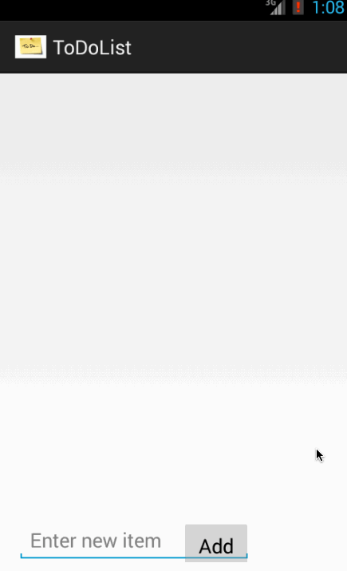

ToDoListApp
===========

This is an Android app to manage list of to-do items. It supports adding, editing and deleting items.

Completed user stories:
- User can view a list of to-do items.
- User can add an item to the list using the textbox and button at the bottom of the main page.
- User can click on an item to bring up a page which allows editing that item.
- User can hold an item to remove it from the list.

Walkthrough of all user stories:

GIF created with [LiceCap](http://www.cockos.com/licecap/).

